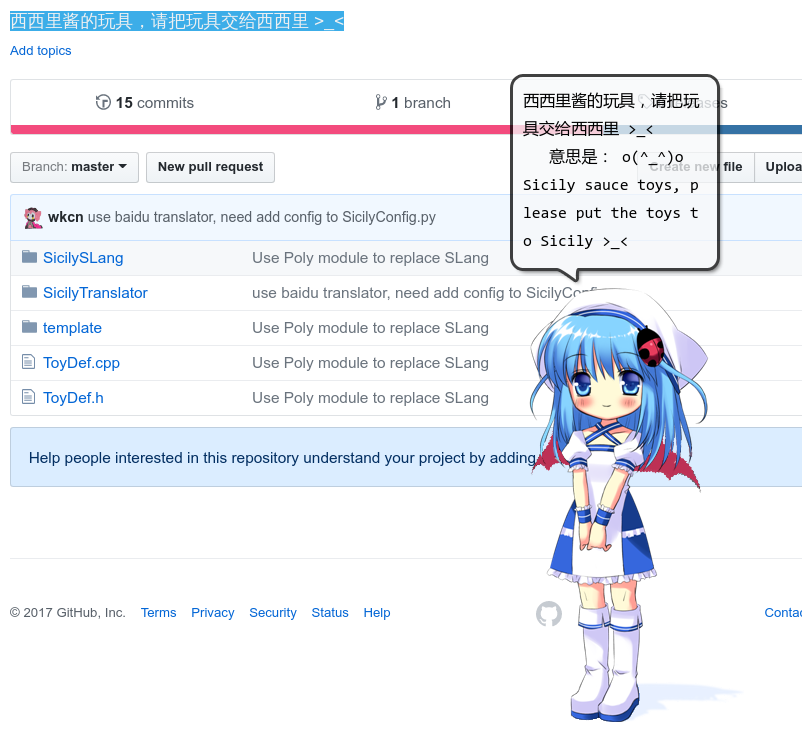

# Sicily酱 - 一个桌面精灵

## 关于

人设出自SPRabbit游戏组《Sicily~零与一的幻想》

http://www.sprabbit.com

图片来自：http://soj.sysu.edu.cn/

## 如何编译

使用Qt编译即可，支持Windows和Linux

## 如何编写插件

插件的编写可参考[西西里酱的玩具，请把玩具交给西西里 >_<](https://github.com/wkcn/SicilyToy)

里面存在插件的C++和Python实现方式

### 实现原理
	
	将需要显示的语句通过UDP发送到3939端口

### 已经实现的插件

- SicilyTranslator 中英文翻译

	需要将要翻译的语句复制到剪贴板

	使用Google翻译翻译句子

	使用必应词典查询单词

- SicilySLang 高精度计算 
	
	项目：[SLang解释器和高精度实现，向Lisp致敬](https://github.com/wkcn/SLang)
	支持带未知数x的运算
